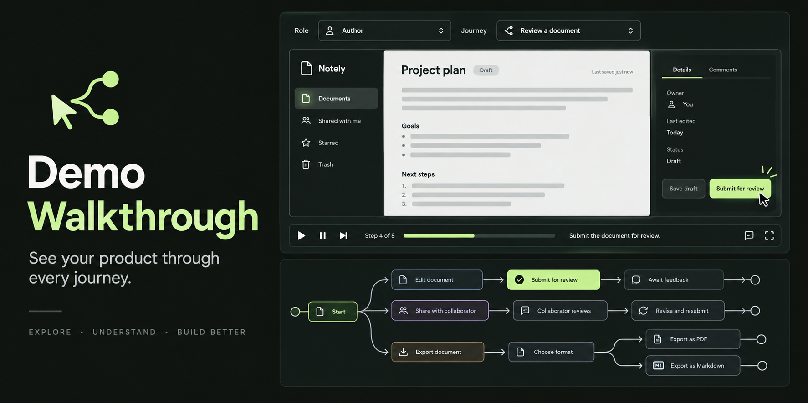

# Demo Walkthrough



*Illustrative cover. The framework is experimental.*

An experimental product demonstration studio with one consistent UI for actor-based journeys across landing pages, signed-in apps, administration tools and provider screens.

The shared framework owns the Studio controller, playback, DAG, subtitles, cursor/click feedback, spotlight, iframe transport, recording lifecycle, DOM capture and replay. Your app provides its definitions, target bindings, permissions, persistence and domain checks.

## Copy into an app

```sh
node src/demo-walkthrough/sync.mjs /path/to/app/packages/demo-walkthrough
node src/demo-walkthrough/sync.mjs /path/to/app/packages/demo-walkthrough --check
```

```tsx
import {DemoWalkthrough} from './packages/demo-walkthrough';
import {adapter} from './demo-adapter';
export function Demonstrations() { return <DemoWalkthrough adapter={adapter}/>; }
```

[Adapter and bridge integration](src/demo-walkthrough/README.md). Consumers need React 19, React DOM and a CSS-capable bundler. They commit their own copy, with no npm package, symlink or cross-repository runtime import.

## Develop and try the reference app

```sh
npm ci
npm run check
npm run build:demo
npm run demo
```

The synthetic document demo has four surfaces, three actors, a real in-browser submit interaction, prepared replay and branching review. Its adapter stores synthetic captures in browser localStorage; agents prepare the replay evidence. It has no ClubSaaS backend dependency. This is deterministic demonstration tooling, not an autonomous agent evaluation.

Source lives in src/demo-walkthrough. ReleaseFast distributes a versioned copy; this repository is the source of truth. Run npm run manifest after reviewed source changes, then check/sync consumers. The repository remains private.

## Validation and limits

`npm run check` covers controller behavior, DAG validation, capture safety, transport authorization and copy integrity. Browser checks use synthetic data. Captures demonstrate UI states; they do not prove business outcomes. DOM capture does not fully capture canvas, video or inaccessible shadow DOM.

## Ask an agent to map your app

Use the copyable [agent brief](src/demo-walkthrough/AGENT-BRIEF.md) from your app's AGENTS.md. It covers actor discovery, journey coverage, nested DAG branches, target bindings and verification. The studio is a review surface: actors and journeys at the top, playback and the workflow map below. Agents prepare the replay evidence; viewers do not manage recordings.
